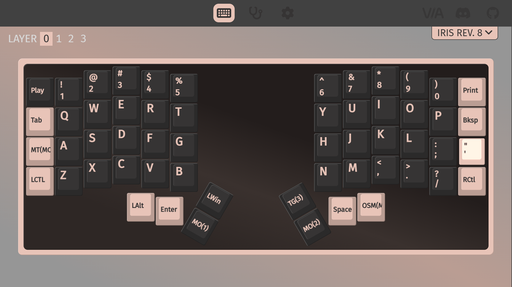
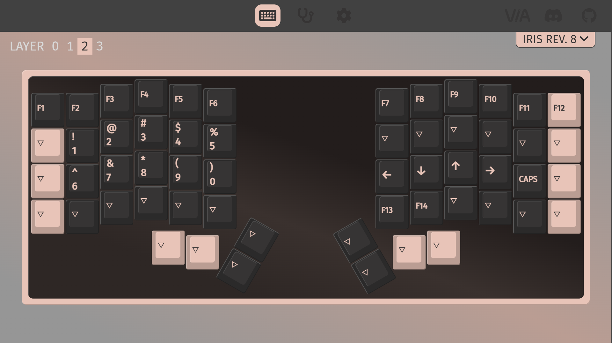
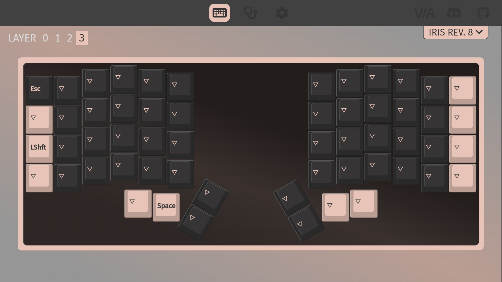

# Keebio Iris Layout

> Note: Second layer is heavily inspired by https://getreuer.info/posts/keyboards/symbol-layer/index.html

## [1.0.1] Latest
### Layer 0: Normal 

### Layer 1: Symbol

### Layer 2: Misc

### Layer 3: Gaming

[1.0.1]: https://github.com/AH134/dotfiles/blob/master/keyboard/1.0.1